# Squad : movifai

* * *

#### Integrantes :
- Esthefany Humpiri
- Milagros Palma
- Isabel Chávez
- Victoria Lung
- Maythe Infantes

### **¿De qué se trata nuestro producto?**

Movifai es una red social que se enfoca en mostrar peliculas de manera amigable, a través de recomendaciones de tus amigos y categorias tematizadas.

### **¿Para qué sirve?**

Sirve para darte la mejor experiencia posible en ver películas ,desde la búsqueda hasta su reproducción.

### **¿Cómo decidieron por ese producto / cómo validaron la idea?**

  1. Nuestro proceso de validación de la idea se inicio con 15 encuestados

  2. Nuestras preguntas fueron las siguientes :
  
    ==¿Qué tipo de aplicaciones usas para ver películas?
    ¿Cómo buscas tus peliculas?
     ¿Te gustaría que esta aplicación te recomiende películas según tu historial de películas?
    ¿Te gustaría ver las películas que vieron tus amigos?
    ¿Te gustaría acceder a la aplicación que usas con tu cuenta de gmail o facebook?==

   3.En los resultados recavados se encontro que :

| Pregunta  | Pregunta|Pregunta| Pregunta  | Pregunta|
|--------|--------||--------|--------|
|   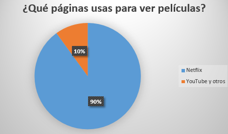     |  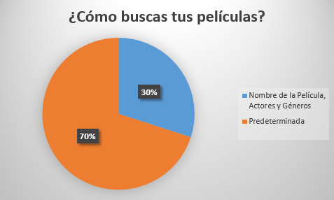       |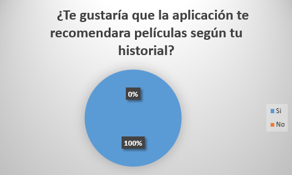 |   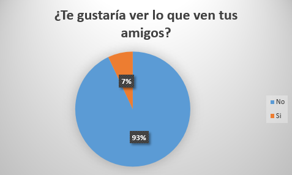     |  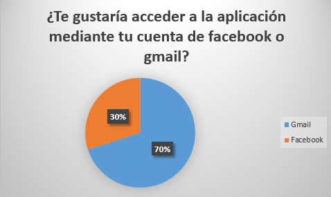       |

### **¿Cómo se organizaron / dividieron el trabajo?**
1. Intercambio de contactos(grupo whatsapp y slack)
2. Retrospectiva de nuestra ultima experiencia con el producto final
3. Delegación de tareas :
   - Github(creación de repositorio/master) - Victoria 
   - Logo - Victoria e Isabel
   - Sketch - todo el equipo
   - Prototipo - Maythe y Esthefany
   - Creación de carpetas - Milagros , Esthefany y Victoria
   - Vista Sign Up - Maythe
   - Vista Inicio - Esthefany
   - README - Isabel, Victoria y Milagros
    
4. Lluvia de ideas :
	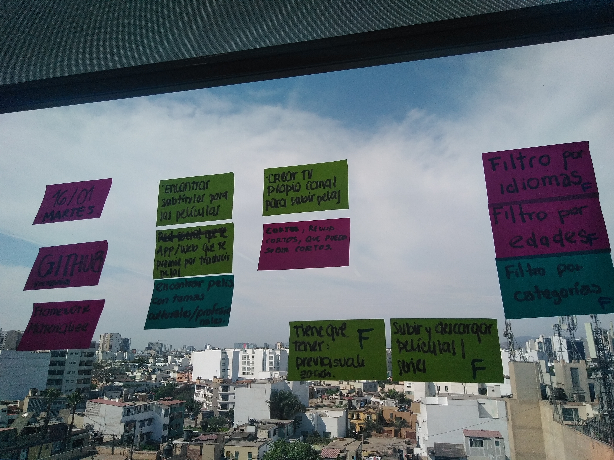

5. Creación de arquetipo:
	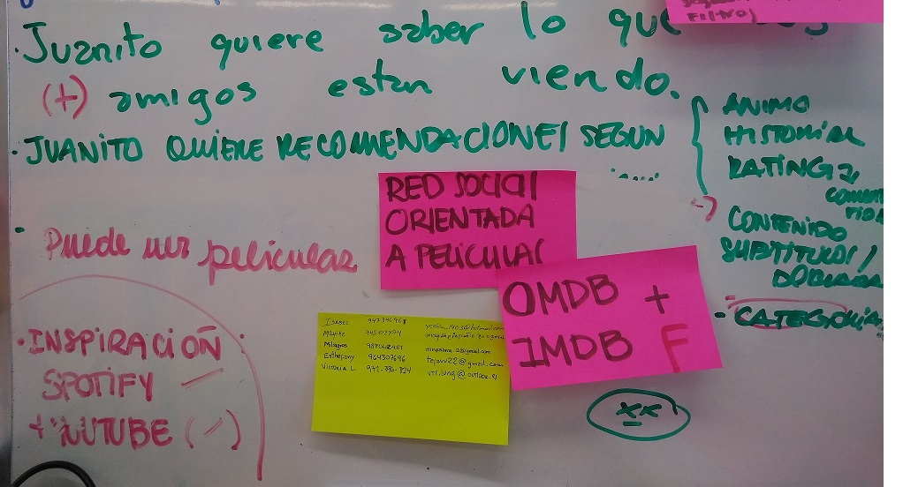
    
6. Creación de prototipado:

- Desktop
	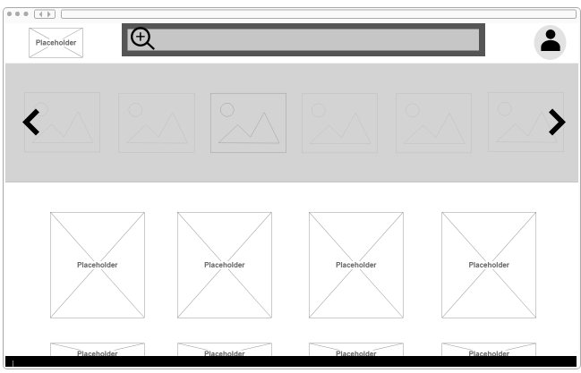
    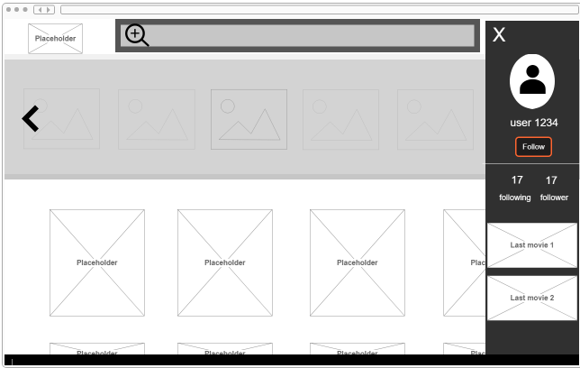
    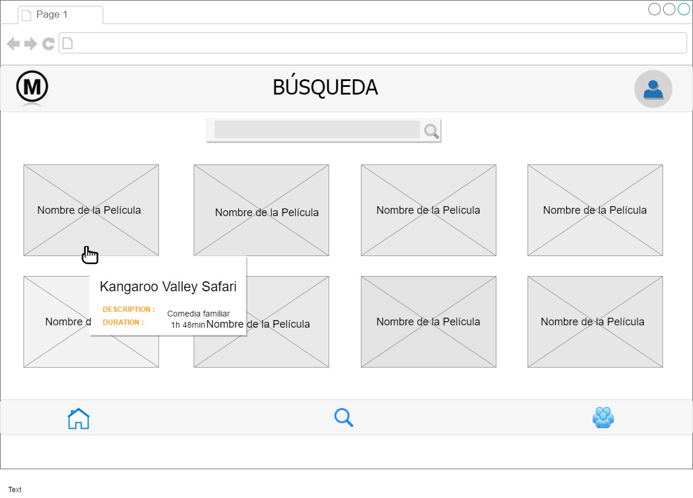
    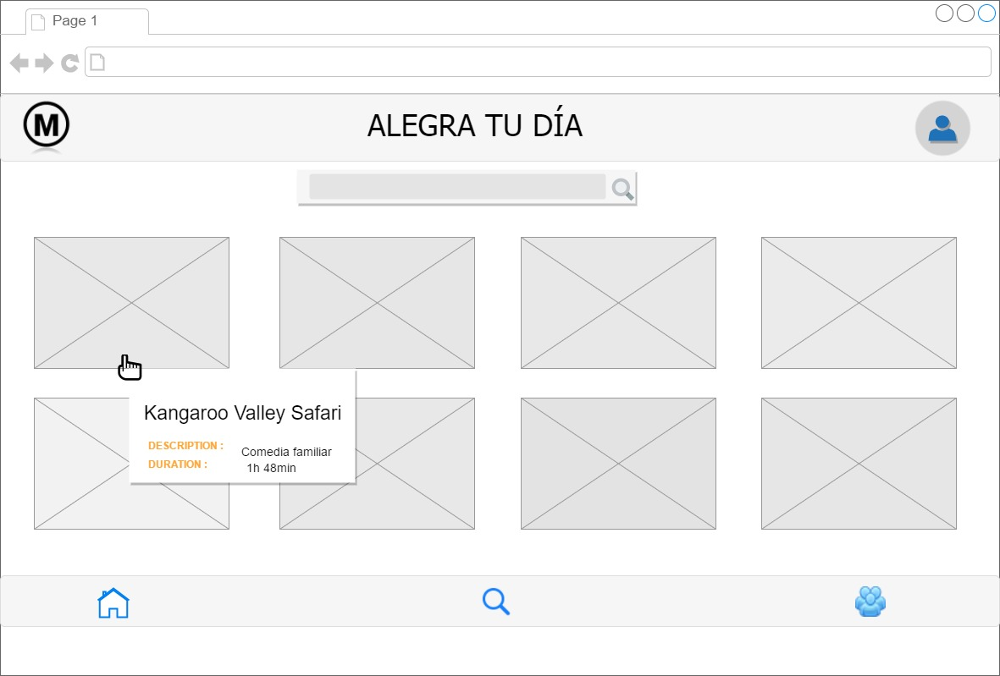

7.Elección de paleta de colores y tipografia :
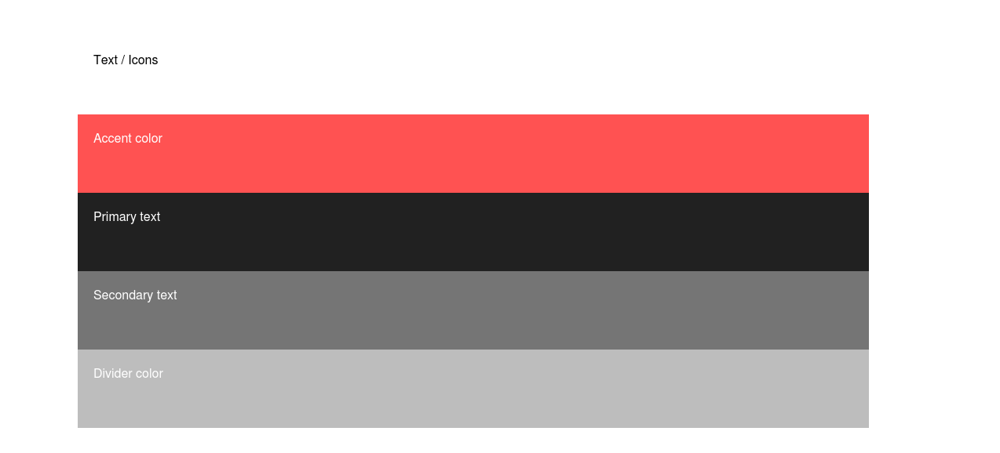
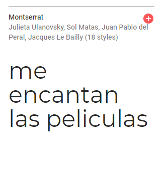

### **¿Hasta dónde hemos llegado?**

- Encuesta 1
- Lluvia de ideas
- Definición del Producto Mínimo Viable
- Definición de las herramientas a usar
- Prototipo inicial de nuestro producto

### **¿Qué esperan tener para el viernes?**

- Maquetación finalizada
- Funcionalidad de la vista principal
- Filtrado básico
- Seguir amigos

